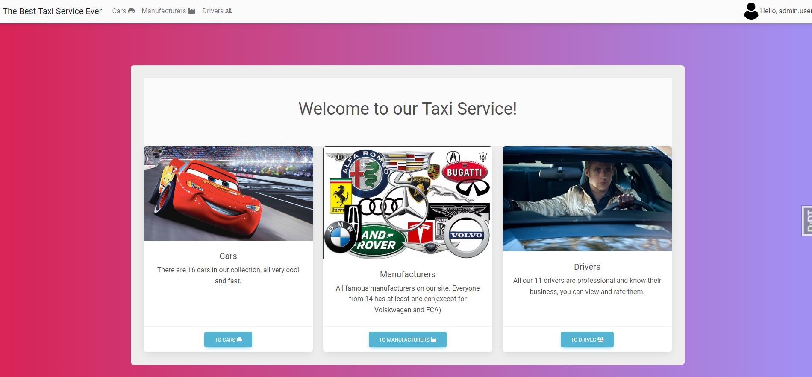
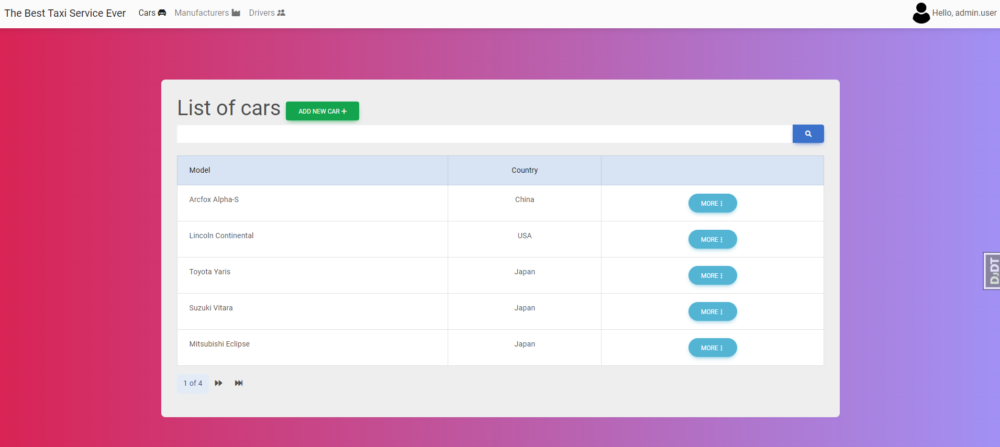
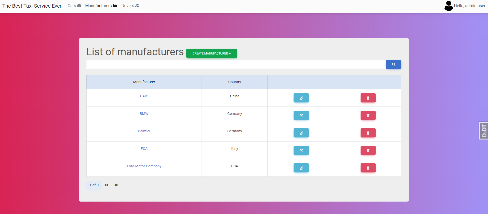
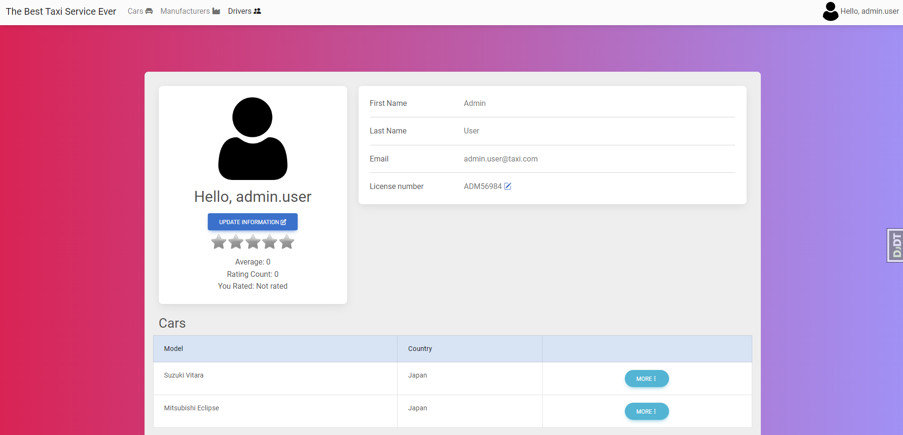
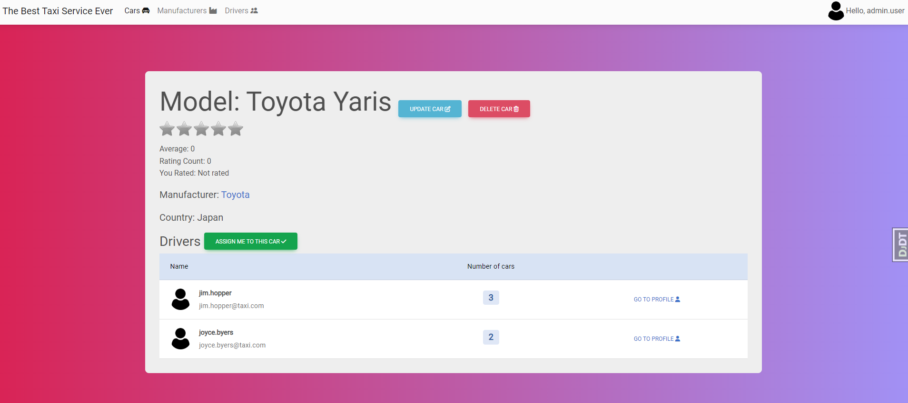
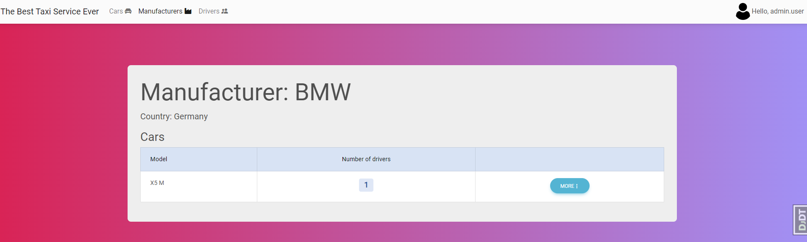
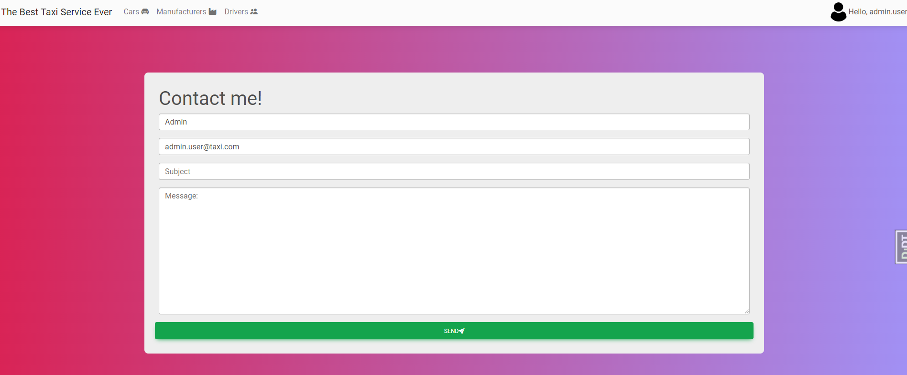
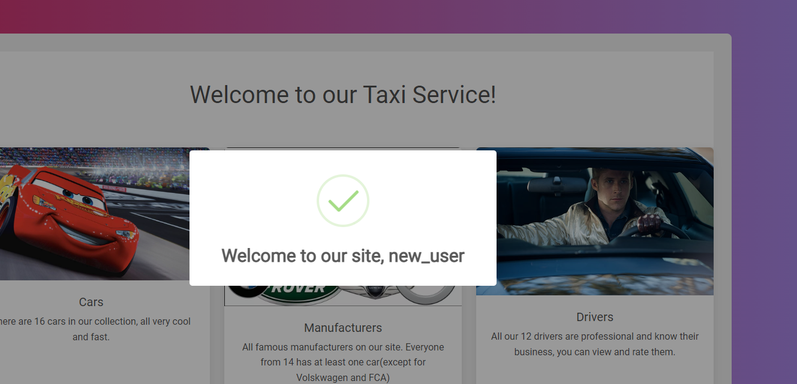
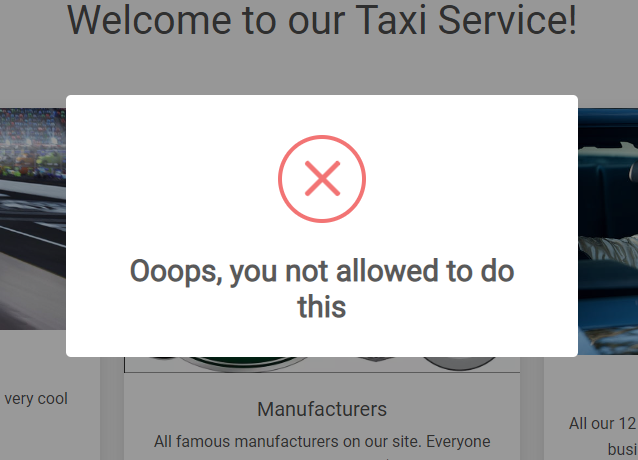

# Best taxi ever

Django project for for managing cars, manufacturers and drivers.

## Check it out
Link on render -> Will be soon

## Installation:


```sh
git clone https://github.com/IvanStored/best-taxi-ever.git
cd best-taxi-ever
python -m venv venv
venv/scripts/activate
pip install -r requirements.txt
python manage.py makemigrations
python manage.py migrate
python manage.py loaddata taxi_service_db_data.json
python manage.py runserver  # starts Django project
```

## Features:
- Authentication functionality for Driver/User
- Managing drivers, cars, manufacturers directly from website
- Registration for new Drivers/Users
- Rating system for cars and drivers (using django-star-rating)
- User can upload own avatar
- Feedback form

## In future(maybe):
- Direct messages for users
- Comment system for cars

# Demo:
## Home page


## Car list

## Manufacturer list

## Driver list

## Driver profile

## Car information

## Manufacturer information

## Feedback form

## Success 

## Error message
